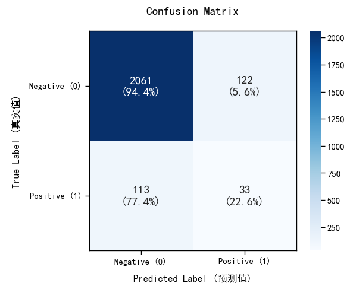
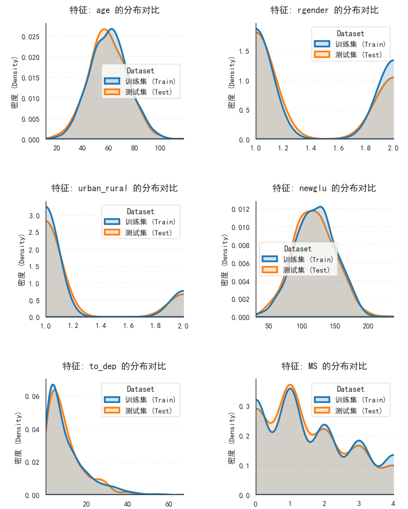

## 项目背景
本模型针对医疗场景，基于生理指标（血糖、血脂、肾功能等）、生活习惯及人口统计学特征，构建风险预测模型，帮助医疗机构实现早期风险识别与干预，提升健康管理效率。

## 核心实现
### 1. 数据预处理流水线

# 数值特征：中位数填补
numeric_transformer = Pipeline(steps=[
    ('imputer', SimpleImputer(strategy='median'))
])

# 类别特征：众数填补+One-Hot编码
categorical_transformer = Pipeline(steps=[
    ('imputer', SimpleImputer(strategy='most_frequent')),
    ('onehot', OneHotEncoder(handle_unknown='ignore'))
])

# 特征整合
preprocessor = ColumnTransformer(
    transformers=[
        ('num', numeric_transformer, numeric_features),
        ('cat', categorical_transformer, categorical_features)
    ])

---

### 2. 模型训练

# 随机森林模型构建
rf_pipeline = Pipeline(steps=[
    ('preprocessor', preprocessor),
    ('classifier', RandomForestClassifier(
        n_estimators=100,
        max_depth=10,
        random_state=42,
        class_weight='balanced'
    ))
])

# 训练与评估
rf_pipeline.fit(X_train, y_train)
y_pred = rf_pipeline.predict(X_test)
y_prob = rf_pipeline.predict_proba(X_test)[:,1]

### 3. 模型评估结果

# 混淆矩阵分析

> **结论：** 模型对存活患者（Negative）预测准确率较高，但对死亡患者（Positive）存在一定漏诊（假阴性），需进一步优化召回率。

---

# 性能曲线 (ROC & PR Curve)
| ROC 曲线 | Precision-Recall 曲线 |
| :---: | :---: |
|  |  |

> **评估指标：** 模型 AUC 达到 **0.80**，展现了较好的分类能力；PR 曲线显示在保持高精确率时召回率仍有提升空间。

---

# 特征重要性 (SHAP 可视化)

> **核心发现：** > * **MS（代谢综合征）** 和 **rgender（性别）** 是模型预测的最关键特征。
> * 较高的 MS 数值显著增加了死亡风险预测的权重。

---

# 数据分布一致性检查

> **数据质量：** 训练集（Train）与测试集（Test）在 age、newglu、MS 等核心特征上的分布基本一致，排除了严重的数据偏移问题。

This is an item in your portfolio. It can be have images or nice text. If you name the file .md, it will be parsed as markdown. If you name the file .html, it will be parsed as HTML. 
